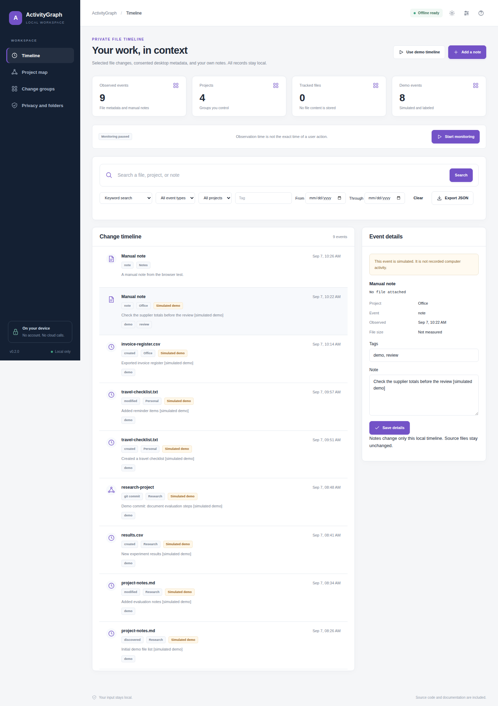
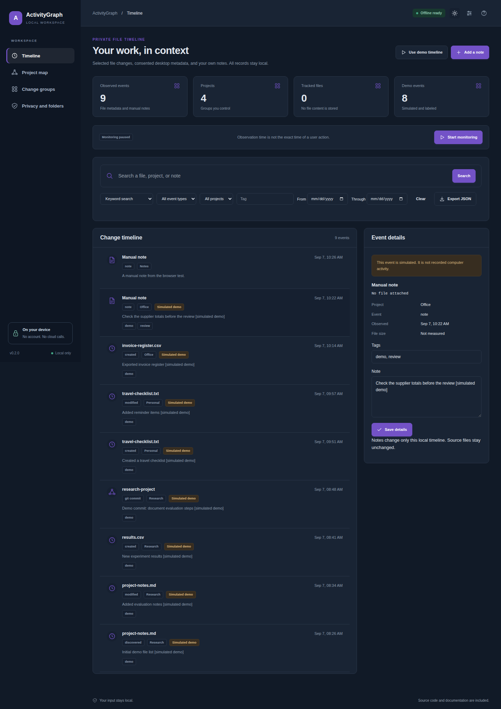

# ActivityGraph

A local timeline for file and project activity.

[](https://github.com/danial-maqbool/ActivityGraph/actions/workflows/tests.yml)


ActivityGraph keeps a private timeline of selected project activity on the computer. It can watch chosen folders, import local Git history, and connect related events without storing file contents.

## Main features

- File create, change, and delete events for selected folders
- Local Git commit history
- Notes, tags, filters, and timeline search
- Project and file relationship graph
- Optional browser history import with explicit consent
- Optional window-title capture with explicit consent
- Retention and erase controls
- Encrypted local history

## Quick start

```bash
git clone https://github.com/danial-maqbool/ActivityGraph.git
cd ActivityGraph
```

**Windows**

```powershell
py -3 bootstrap.py
.\start.bat --demo
```

**Linux / macOS**

```bash
python3 bootstrap.py
sh start.sh --demo
```

For normal use, start without `--demo` and choose the folders you want to monitor.

## Screenshots

<p align="center">
  
  
</p>

## Project layout

```text
app/        activity and timeline logic
web/        local interface
localdesk/  local runtime, vault and jobs
examples/   sample data
tests/      automated tests
scripts/    verification tools
docs/       setup, design and test notes
```

## Notes

Folder monitoring is based on polling, so very short changes between scans can be missed. Browser history and window titles are never collected automatically and need separate consent.

More details: [Setup](docs/SETUP.md) · [User guide](docs/USER_GUIDE.md) · [Architecture](docs/ARCHITECTURE.md) · [Testing](docs/VERIFICATION.md) · [Security](SECURITY.md)

## License

MIT. See [LICENSE](LICENSE).
