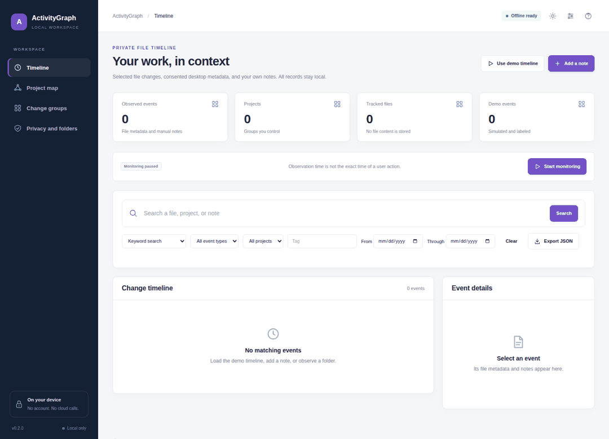
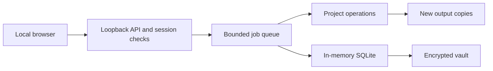

# ActivityGraph

Remember which files changed during a project session. Start with selected folders, then add notes and review related events. More sensitive sources need separate consent.

**Local processing. No API keys. No account. CPU operation. Encrypted application database.**

[](https://github.com/danial-maqbool/ActivityGraph/actions/workflows/tests.yml)




The recording uses synthetic examples in the working application. Frame timing is illustrative.

## Local testing handoff

Start with [HANDOFF.md](HANDOFF.md) after cloning. It lists the remaining local-machine checks.
Read [requirements and test commands](docs/LOCAL_TESTING.md), then give the [agent brief](docs/LOCAL_AGENT_PROMPT.md) to your local agent.
Use `python bootstrap.py --dev` to install test tools in this project environment.
Keep new reports under `artifacts/local-qa`. A historical release report is not a test of your PC.

## What you can do

| Feature | Behavior |
| :--- | :--- |
| **Selected folders** | Record created, changed, and removed files. Do not record file contents. |
| **Local Git history** | Import commit metadata from selected repositories without contacting a remote. |
| **Window titles** | Enable visible, consent-based capture for the current desktop session. Pause it at any time. |
| **Browser history import** | Choose a local Chromium or Firefox history database. Import it only after explicit consent. |
| **Timeline search** | Search metadata with keywords or a local semantic model. Filter events by project and kind. |
| **Project graph** | Connect observed files and projects. Group related activity into sessions. |
| **Retention controls** | Add notes and tags. Delete periods or erase recorded history without changing source files. |
| **Encrypted worker** | Keep records encrypted. Resume selected-folder monitoring through a user-login worker. |

## Start on your PC

Install Python 3.11 or later. Download this repository or clone it:

```sh
git clone https://github.com/danial-maqbool/ActivityGraph.git
cd ActivityGraph
```

**Windows**

```powershell
py -3 bootstrap.py
.\start.bat
```

**Linux or macOS**

```sh
python3 bootstrap.py
sh start.sh
```

Setup creates a project-local `.venv`. The first normal start asks for a vault passphrase with at least 12 characters. Keep the passphrase. There is no password-reset server.

The application opens at `http://127.0.0.1:8764`. Try synthetic data without a persistent database:

```sh
# Windows
start.bat --demo

# Linux or macOS
sh start.sh --demo
```

The first package installation needs internet access or pre-downloaded wheels. Normal processing stays local. Install Tesseract and its local language data for OCR. RecoveryLab also uses FFmpeg and ffprobe for video recovery. Read [Setup](docs/SETUP.md) for OS instructions and offline installation.

## Daily use

Read the [user guide](docs/USER_GUIDE.md). Start with the included examples. Select your files only after checking the example outputs.

Closing the browser leaves the local Python process running. Press Ctrl+C in its terminal to stop it. A user-login service can keep selected background jobs running without an open terminal. Service installation is explicit and uses the OS credential store. See [Background operation](docs/BACKGROUND.md).

## Where your data goes

| Location | Contents |
| :--- | :--- |
| `.local-data/app.vault` | Authenticated encrypted database snapshot. |
| `.local-data/inbox/` | Files explicitly uploaded or pasted into the application. |
| `.local-data/exports/` | New outputs and reports. |
| OS credential store | Vault passphrase only after explicit service setup. |

SQLite works in memory. The application encrypts persistent database snapshots and database backups with AES-256-GCM. Source files, exported files, and parser temporary files are not encrypted by the application. Protect those files with OS disk encryption when needed.

## Design



```text
app/          Project operations and validation
localdesk/    Local HTTP, jobs, vault, OCR/PDF, and semantic components
web/          HTML, CSS, and JavaScript without external runtime assets
examples/     Synthetic input files
tests/        Unit, integration, and adversarial regression tests
scripts/      Browser checks and release verification
docs/         Setup, API, design, reports, and recorded media
```

Each repository contains its runtime source. No other repository is required after cloning. The shared runtime has a recorded source revision in [Runtime provenance](docs/RUNTIME.md).

## Verify a change

```sh
# Use .venv\Scripts\python.exe on Windows.
.venv/bin/python -m pip install -r requirements-dev.txt
.venv/bin/python scripts/verify.py
.venv/bin/python -m playwright install chromium
.venv/bin/python scripts/browser_check.py
```

The CI matrix runs on Windows, macOS, and Ubuntu with Python 3.11 and 3.13. Ubuntu also runs native-tool integration tests and a direct-navigation browser check. Reports list every skipped test. Read [Verification](docs/VERIFICATION.md) before drawing conclusions from a test count.

## Processing boundaries

Folder polling can miss changes between scans. Window titles depend on OS permissions and a supported desktop session. Browser import reads a selected local database, not private browsing or remote accounts. A stopped or sleeping computer cannot record events.

Passing tests does not prove that all inputs or computers work. Read [Security](SECURITY.md) and [Processing boundaries](docs/LIMITS.md).

## Documentation

[User guide](docs/USER_GUIDE.md) · [Setup](docs/SETUP.md) · [API](docs/API.md) · [Architecture](docs/ARCHITECTURE.md) · [Verification](docs/VERIFICATION.md) · [Contributing](CONTRIBUTING.md)

## License

MIT. See [LICENSE](LICENSE). External tools and model weights keep their own licenses. See [Sources](docs/SOURCES.md).
